This Folder holds the files used in the financial use case example.

This use case consists of 5 main parts. Some are implemented at differend location. The location of the parts are mentioned in the description of each part.

## Table of Contents
1. [Data Generation](#data-generation)
2. [The Broker](#the-broker)
3. [The MCP Server](#the-mcp-server)
4. [The POS-Client](#the-pos-client)
5. [The Data Consumer](#the-data-consumer)
6. [Architecture Diagram](#architecture-diagram)
7. [Deployment Instructions](#deployment-instructions)

## Data Generation
The data generation part is mocking a POS terminal which generates transaction data. This includes a normal stream of transaction data as well as retained messages. This Data could look like this: 
```json
{
  "id": "123456789",
  "timestamp": "2025-12-03T14:32:00Z",
  "signature": "sha256:1a2b3c", 
  "items": [
    {"name": "A", "qty": 2, "net": 3.00, "vat": 7},
    {"name": "B", "qty": 1, "net": 2.80, "vat": 19}
  ],
  "total_gross": 6.20,
  "payment_method": "cash",
  "cancellation_flag": false,
  "cashier_id": "maxmustermann"
}
```

## The Broker
The broker is a MQTT Broker that has the addition of using PBAC (Policy-Based Access Control) policies to control access to topics and messages. In Our case we are deploying the HiveMQ Broker with the [HivePBAC extension](https://github.com/ZODIAC-Project/HiveZODIAC). 

## The MCP Server
[Purpose-Aware MCP Server](https://github.com/ZODIAC-Project/PurposeAwareMCP/blob/main/README.md)

## The LLM
TODO: Add LLM description 

## The POS-Client
The client simulates a a POS terminal that generates sample receipts and sends them to a LLM endpoint. It can be configured to send a number of messages or retained messages.

## The Data Consumer
The data consumer sends a request to the MCP client to retrieve retained messages for a specified topic.

## Architecture Diagram


## Deployment Instructions
Frome home directory of this repository, follow these steps to deploy the financial use case in a kubernetes environment using minikube. Follow the deployments instruction of the external components to have a running broker and MCP server.

```zsh
docker build -f Dockerfile.dataConsumer -t data-consumer:latest . &&
docker build -f Dockerfile.posClient -t pos-client:latest .
```
2. Load the Docker images into your Minikube cluster (if using Minikube):

```zsh
minikube image load data-consumer:latest &&
minikube image load pos-client:latest
```
3. Apply both Kubernetes deployment manifest to create the resources:

```zsh
kubectl apply -f k8s/
```


